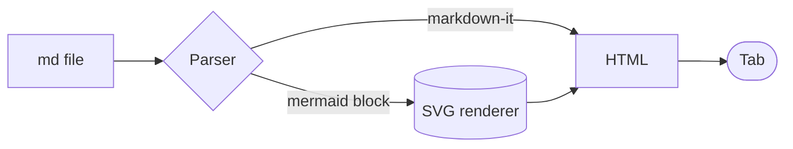
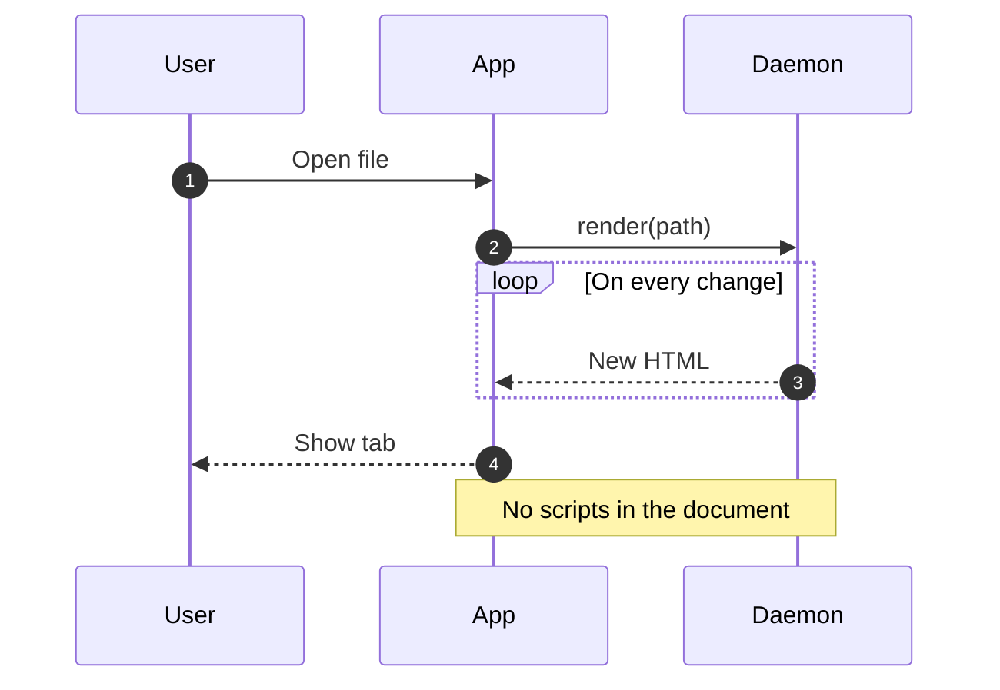
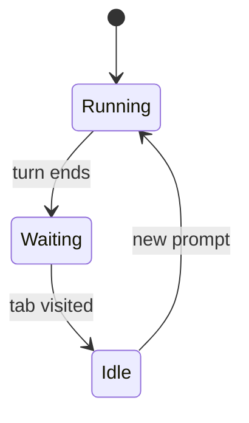
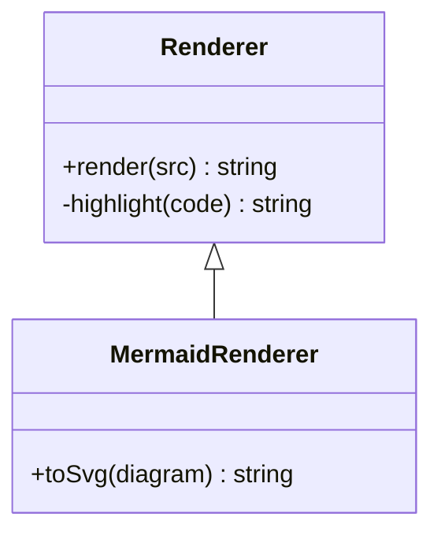
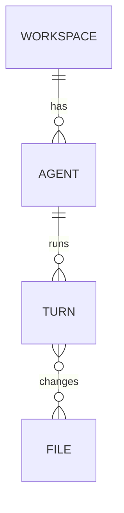
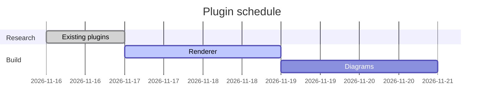
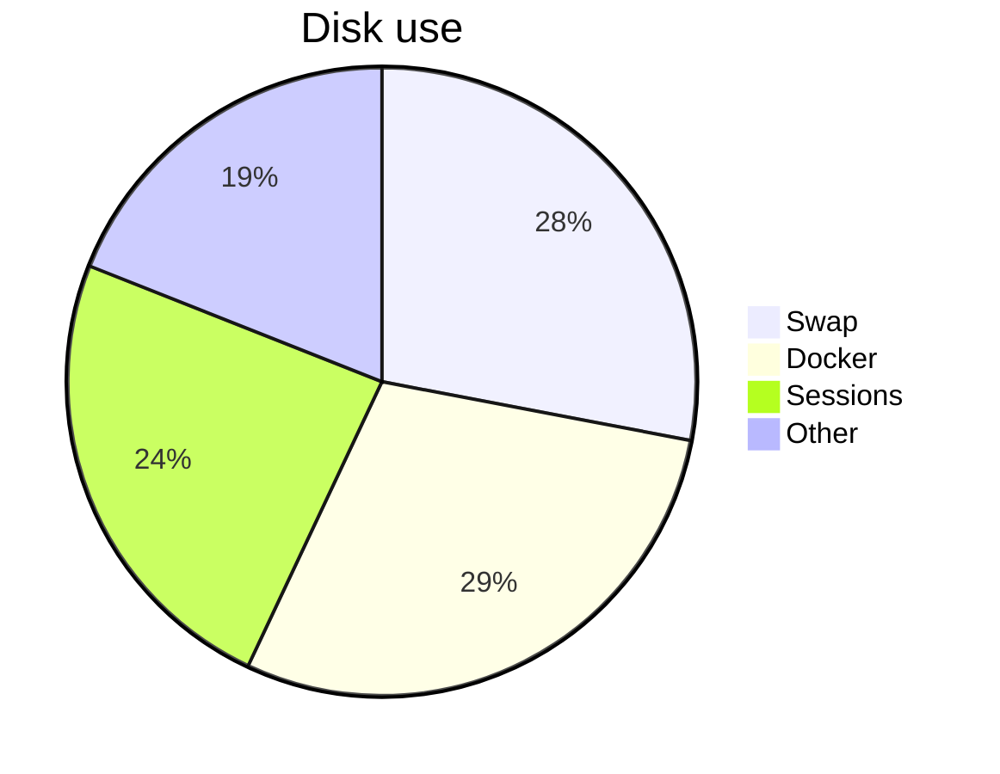
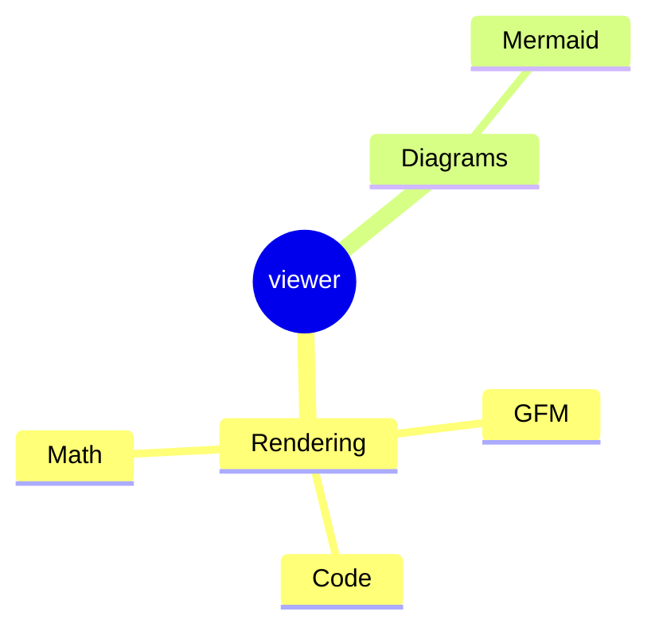
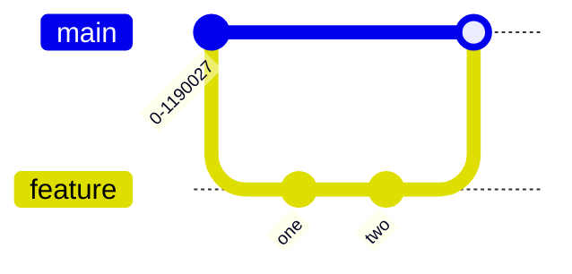

# Diagrams

```mermaid
flowchart LR
    A[md file] --> B{Parser}
    B -->|markdown-it| C[HTML]
    B -->|mermaid block| D[(SVG renderer)]
    D --> C
    C --> E([Tab])
```

```mermaid
sequenceDiagram
    autonumber
    participant U as User
    participant P as App
    participant D as Daemon
    U->>P: Open file
    P->>D: render(path)
    loop On every change
        D-->>P: New HTML
    end
    P-->>U: Show tab
    Note over P,D: No scripts in the document
```

```mermaid
stateDiagram-v2
    [*] --> Running
    Running --> Waiting: turn ends
    Waiting --> Idle: tab visited
    Idle --> Running: new prompt
```

```mermaid
classDiagram
    class Renderer {
        +render(src) string
        -highlight(code) string
    }
    class MermaidRenderer {
        +toSvg(diagram) string
    }
    Renderer <|-- MermaidRenderer
```

```mermaid
erDiagram
    WORKSPACE ||--o{ AGENT : has
    AGENT ||--o{ TURN : runs
    TURN }o--o{ FILE : changes
```

```mermaid
gantt
    title Plugin schedule
    dateFormat YYYY-MM-DD
    section Research
    Existing plugins :done, a1, 2026-11-16, 1d
    section Build
    Renderer :active, b1, 2026-11-17, 2d
    Diagrams :b2, after b1, 2d
```

```mermaid
pie title Disk use
    "Swap" : 28
    "Docker" : 29
    "Sessions" : 24
    "Other" : 19
```

```mermaid
mindmap
  root((viewer))
    Rendering
      GFM
      Code
      Math
    Diagrams
      Mermaid
```

```mermaid
gitGraph
    commit
    branch feature
    checkout feature
    commit id: "one"
    commit id: "two"
    checkout main
    merge feature
```
